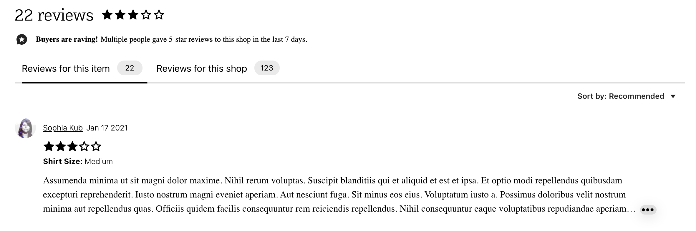
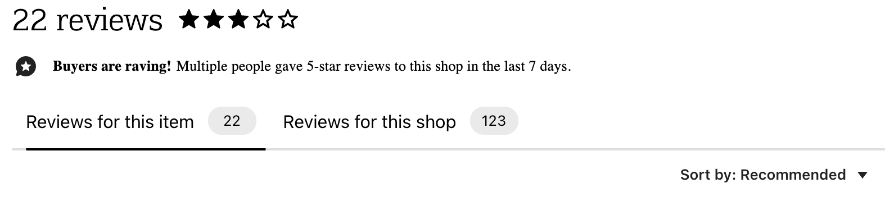
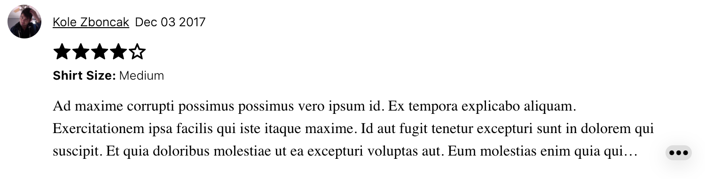
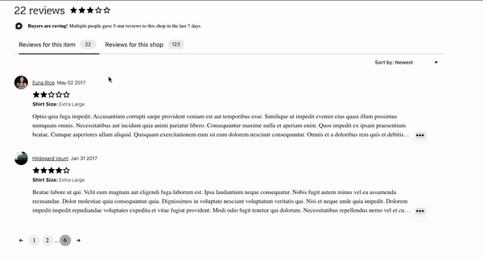
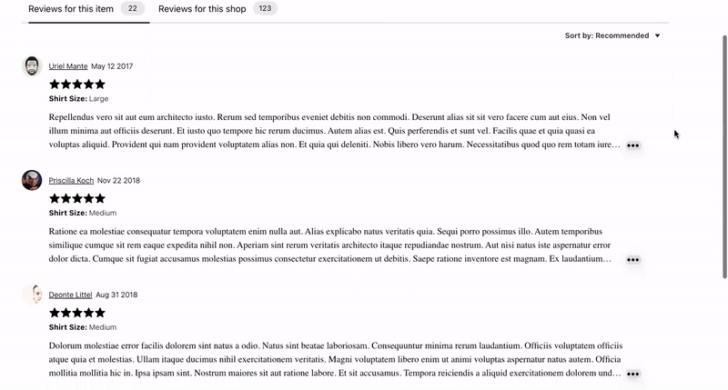
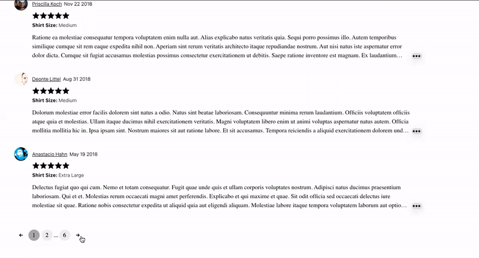
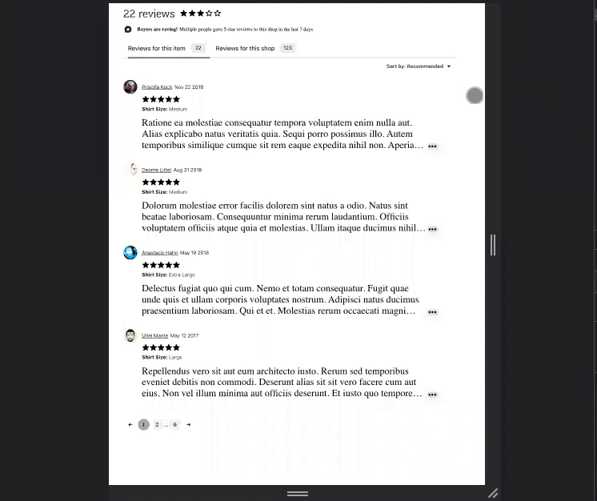

# Etsy Reviews Service

> Project description








<!-- 


 -->


## Related Projects

  - https://github.com/Grace-OMalley/etsy-addtocart
  - https://github.com/Grace-OMalley/etsy-imagesmain

## Table of Contents

1. [Usage](#Usage)
1. [Requirements](#requirements)
1. [Development](#development)

## Usage

- npm run build: Build webpack bundle with watch flag.
- npm run server: Start the nodemon server.
- npm run seed: Seed data to mongodb.

## Requirements

An `nvmrc` file is included if using [nvm](https://github.com/creationix/nvm).

- Node 6.13.0
- etc

## Development

### Installing Dependencies

From within the root directory:

```sh
npm install -g webpack
npm install
```

